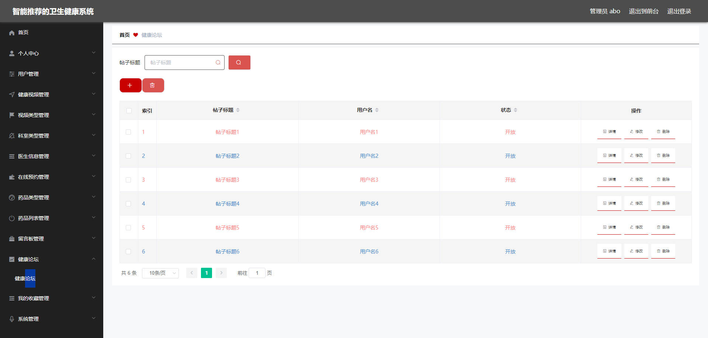

# 基于Springboot的基于智能推荐的卫生健康系统 

## Springboot-0065


## 技术栈

Springboot mybatisplus vue mysql maven


## 数据库表(17张)


## 功能介绍

```properties
用户功能有个人中心，健康视频管理，视频类型管理，科室类型管理，医生信息管理，在线预约管理，我的收藏管理等。

管理员功能有个人中心，用户管理，健康视频管理，视频类型管理，科室类型管理，医生信息管理，在线预约管理，健康论坛管理，我的收藏管理，留言板管理，系统管理等。
```


## 图片

### 前台


### 后台




## 访问路径

### 前台

```properties
http://localhost:8080/springboots3cpm/front/pages/login/login.html

账号 1
密码 1
```

### 后台

```properties
http://localhost:8080/springboots3cpm/admin/dist/index.html#/login

账号 abo
密码 abo
```


## 功能图


## 文档目录


## 打赏或交流


